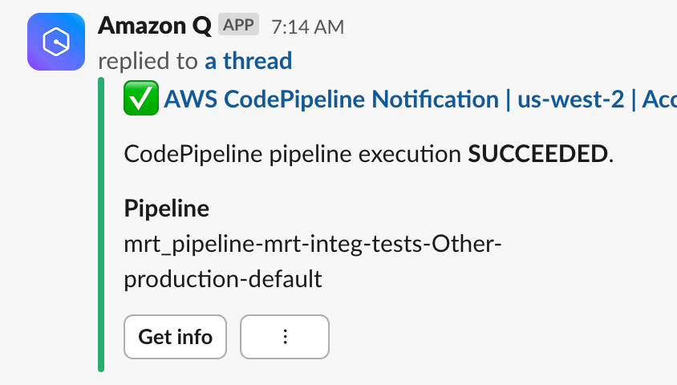
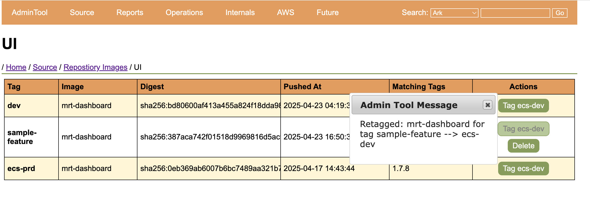

## On the Journey to DevOps, Start with Your Build

- Terry Brady
- Software Developer, California Digital Library
- https://github.com/terrywbrady

---

### DevOps Journey
- My Team is on a journey to DevOps Adoption
- We started by recreating our build system using infrastructure as code
- delighted by the results

---

## Background - About My Team

----

### [Merritt Digital Preservation Repository](https://merritt.cdlib.org)
- 4.6m objects
- 66m digital files
- 1.6 PB stored across 3 cloud vendors
- Ingest
  - Average: 2.6 TB / week
  - Peak: 14 TB / week

----

### Current Merritt Production System 
- 7 microservices
- 27 servers

----

### Merritt migrated to AWS around 2016
- Lift and shift
- Managed EC2 instances
- Gradual adoption of cloud paradigms within the system

----

### Cloud state
- S3
- RDS
- ALB, WAF
- Lambda
- SSM Parameters
- OpenSearch

----

### Merritt Staffing
- 1 PM
- 3 Dev
- Shared resources
  - 1 DevOps engineer
  - 3 SysAdmins 

----

### Current Production DevOps
- DevOps engineer manages of Puppet and Ansible resources for servers
  - Not core skills of the majority of the dev team
- AWS permissions granted to EC2 instances
- Very limited console access
- SysAdmins implement AWS changes

----

### Devs and DevOps
- Want to Code
- Excited by cloud technologies
- Lots to learn
- Want more control
- Hesitant about becoming SysAdmins

----

### DevOps Direction
- Infrastructure as code
- Disposable resources (rather than patching persistent assets)
- Scale up and down to meet demand
  - Persistent resources make this difficult
  - Can lead to over-provisioning

----

### Migration plan
- Multi-year migration
- Resources moving from centralized account to program specific accounts
  - Dev teams will have console access 
- Everything in production will be created with infrastructure as code

---

### Start simply
- Colleague was publishing some resources to CloudFront
  - I had thought of Cloud Front as an expensive solution
  - Learned it was a preferred way of publishing assets
- Very handy for Merritt
- Merritt Dev Resources

----

### Project 1: Generate Dev Documentation
- [JavaDoc](https://merritt.uc3dev.cdlib.org/api/mrt-zk/java/org/cdlib/mrt/zk/package-summary.html)
- [RubyDoc](https://merritt.uc3dev.cdlib.org/api/mrt-zk/ruby/MerrittZK.html)
- Cumbersome to keep up to date without a website

----

### Code Build process
- Git commit
- Compile / Bundle
- Generate java doc / ruby doc
- Copy to S3
- Update CloudFront

----

### Project 2: Generate an index page for Dev Resources
- Commit markdown
- Push to S3
- Update CloudFront

----

### Demo: Java Doc/Ruby Doc
- [Merritt Dev Resources](https://merritt.uc3dev.cdlib.org/)
- This presentation is hosted here!

----

### Great introduction to Infrastructure as Code!

----

### Resources Generated (publishing)

- ⚙️ S3 bucket for published artifacts
- ⚙️ CloudFront CDN
- ⚙️ Cert
- ⚙️ DNS records

----

### Resources Generated (build)
- ⚙️ S3 bucket for build artifacts
- ⚙️ CodePipeline
- ⚙️ CodeBuild
- ⚙️ CodeStarSourceConnection

----

### Resources Created without Infrastructure as Code
- 🛠️ AWS Connector for GitHub

----

### Infrastructure as Code at CDL
- AWS CloudFormation
- Sceptre
- jinja2 templates

---

### Our Progress Spiraled!

----

### Project 3: Generate javadocs for all Merritt libraries

- Create a CodePipeline / CodeBuild for all libraries

----

### Publish Swagger (API) documentation to CloudFront

----

### Project 4: Build java libraries and publish to an artifact repo
- ⚙️ AWS CodeArtifact

----

### Project 5: Build java services using published artifact resources

---

### Demo: Service build

----

### Demo: Tag Repo

```bash
Total 0 (delta 0), reused 0 (delta 0), pack-reused 0
remote: This repository moved. Please use the new location:
remote:   git@github.com:CDLUC3/mrt-ingest.git
To github.com:cdluc3/mrt-ingest
 * [new tag]         demo-1.3.0 -> demo-1.3.0
```

----

### Demo: GitHub


----

### Demo: AWS Connector for GitHub


----

### Demo: AWS Connector for GitHub
- enables the tracking of commits and tags
- This allows AWS CodePipeline to clone selected private repos
- Some AWS screens call this an *AWS CodeConnection*

----

### Demo: CodePipeline


----

### Demo: CodePipeline 
- will be triggered by the "tag" action.  
- build will be initiated with the tagged commit

----


----

### Demo: CodeBuild


----

### Demo: CodeArtifact


----

### Demo: CodeArtifact Details


---

### Project 6: Build docker images used in integration testing of java services
- ⚙️ Elastic Container Registry

----

### Project 7: Build all Merritt services at docker images

----

### Demo: docker image builds

----

### Demo: Elastic Container Registry (ECR)


----

### Project 8: Schedule daily builds
- Ensure up to date docker images (vulnerabilities)
- ⚙️ EventBridge Scedule
- ⚙️ AWSChatbotSlack Notification

----

### Demo


----

### Project 9: Run java end to end testing using Code Pipeline/CodeBuild

----

### Project 10: Schedule end to end testing every weekday

----

### Demo: Daily End to End Testing Notification Start


----

### Demo: Daily End to End Testing Notification Finished


----

### Demo: Daily End to End Testing Details


----

### Demo: End to End Test Logs

```
Finished in 9 minutes 39 seconds (files took 2.02 seconds to load)
50 examples, 0 failures, 3 pending
```

----

### Replaced our legacy build system (Jenkins)
- More feature rich
- Just in time builds
- Faster builds
- More complete builds
- End to end testing can be run by anyone - no environment configuration

----

### Team Response
- Excited for the change
- Appreciated the improvements
- More engaged/interested in the DevOps migration effort

----

### Ready for DevOps?
- By the end of this, I felt reasonably proficient with Sceptre

---

### Current effort
- Building Elastic Container Service ECS stack (DEV)
  - Run our services as containers
- Using those docker images
- Auto-deploy to DEV stack at the end of the build

----

### Creation of admin tool
- View state of app stack
- View tags available as docker images
  - Tag specific images for deployment
  - Trigger deployment from the app

----

### Merritt ECS Stack


----

## Goal: Create a feature Branch for Merritt UI, Depoloy to ECS Dev

----

## Create feature branch `sample-feature`

----


----

### CodeBuild runs in the background...
- image mrt-dashboard:sample-feature pushed to ECR

----

## In the Admin Tool, view Repository Images for Merritt UI

- since this is not associated with a tag, we must view the image listing

----


----

### Click `Tag ecs-dev`

----



----

### Reload Page

----

Note that a second tag has been assigned to the image


---

## Goal: Tag current code in Git in prepraration for deployment to Stage

----

By Merritt conventions, only tagged branches should be deployed to stage or prod

----

## Tag Git Branch with `1.7.9`

----

```
$ git tag 1.7.9
$ git push --tags
Total 0 (delta 0), reused 0 (delta 0), pack-reused 0
To github.com:CDLUC3/mrt-dashboard
 * [new tag]           1.7.9 -> 1.7.9
```

----

### CodeBuild Runs in the background...
- mrt-dashboard:1.7.9 is pushed to ECR

----

## View Repository Tags for Merritt UI

----


----

### Click `Tag ecs-stg`

----


----

### Reload Page

----


---

## Goal: Deploy to to ECS Prod

----

### Proposal: Require a documented "Release" for Production Deployments

----

Note that 1.7.9 does not have a documented release


----

### Click `Create` to document a release on GitHub

----


----

### Scroll and Click `Publish Release`

----


----

### Return to the Repository Tag listing

----

Note the published release info


----

### Click `Tag ecs-prd`

----


----

### Reload Page

----

Note that the ecs-prd image has migrated


----

### Services Configured
- ⚙️ ECS Cluster
- ⚙️ ECS Service
- ⚙️ ECS Task Definition
  - ⚙️ ECS Container Definition
- ⚙️ ServiceConnect Configuration 

----

### Additional Services
- ⚙️ Elastic Load Balancer
- ⚙️ Elastic File System

----

### Resources Created without Infrastructure as Code
- 🛠️ RDS Database

---

## Why start with the build?

----

### Build may be ripe for automation
- Critical, but not "Production"
- Always more things that are useful to automate
- In our case, we had end to end test script that we run manually after deployment/patching
- This was a great excuse to automate it

----

### Separate from production
- Great experimental platform
- Easy to plug into a production system

----

### We appreciated the nuances of tagging
- Library (jar and gem) tagging behaves differently than 
- Deployed service tagging
- Docker image tags behave differently from source code tags
- Often useful to re-use the same tag names!

---

## Thank You

- Terry Brady
- https://github.com/terrywbrady
- **Terry Brady(UCOP-CDL)** on UCTech Slack
