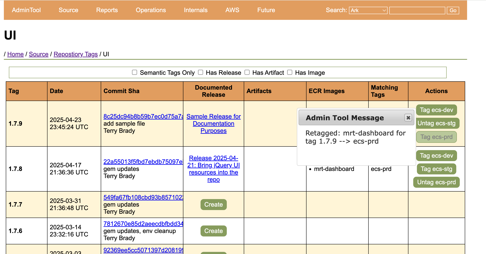

## On the Journey to DevOps, Start with Your Build

- Terry Brady
- Software Developer, California Digital Library
- https://github.com/terrywbrady


---

## DevOps Journey
- My Team is on a journey to DevOps Adoption
- We started by recreating our build system using **infrastructure as code**
- delighted by the results

---

# Background - About My Team

----

### [Merritt Digital Preservation Repository](https://merritt.cdlib.org)
- 4.6m objects
- 66m digital files
- 1.6 PB stored across 3 cloud vendors
- Ingest
  - Average: 2.6 TB / week
  - Peak: 14 TB / week

----

### Current Merritt Production System 
- 7 microservices
- 27 servers

----

### Merritt migrated to AWS around 2016
- Lift and shift
- Managed EC2 instances
- Gradual adoption of cloud paradigms within the system

----

### Cloud Services we Use
- S3
- RDS
- ALB, WAF
- Lambda
- SSM Parameters
- OpenSearch

----

### Merritt Team Makeup
- 1 PM
- 3 Dev
- Shared resources
  - 1 DevOps engineer
  - 3 SysAdmins 

----

### Current Production DevOps
- DevOps engineer manages of Puppet and Ansible resources for servers
  - Not core skills of the majority of the dev team
- AWS permissions granted to EC2 instances
- Very limited console access
- SysAdmins implement AWS changes

----

### Devs and DevOps
- Want to Code
- Excited by cloud technologies
- Lots to learn
- Want more control
- Hesitant about becoming SysAdmins

----

### DevOps Direction
- 🎯 Infrastructure as code
- 🎯 Disposable resources (rather than patching persistent assets)
- 🎯 Scale up and down to meet demand
  - Persistent resources make this difficult
  - Can lead to over-provisioning

----

### Migration plan
- Multi-year migration
- Resources moving from centralized account to team-specific accounts
  - Dev teams will have console access 
- Everything in production will be created with infrastructure as code

----

### Infrastructure as Code at CDL
- [AWS CloudFormation](https://docs.aws.amazon.com/AWSCloudFormation/latest/UserGuide/aws-template-resource-type-ref.html)
- [Sceptre](https://docs.sceptre-project.org/latest/)
- [jinja2 templates](https://jinja.palletsprojects.com/en/stable/templates/)

---

# Part 1: Start Simply

----

### Inspiration to Get Started
- Colleague was publishing some resources to CloudFront
  - I had thought of Cloud Front as an expensive solution
  - Learned it was a preferred way of publishing assets
- Great solution for "Merritt Dev Resources"

----

### Build Project 1: Generate Dev Documentation
- [JavaDoc](https://merritt.uc3dev.cdlib.org/api/mrt-zk/java/org/cdlib/mrt/zk/package-summary.html)
- [RubyDoc](https://merritt.uc3dev.cdlib.org/api/mrt-zk/ruby/MerrittZK.html)
- Cumbersome to keep up to date without a website

----

### Code Build process
- Git commit
- Compile / Bundle
- Generate java doc / ruby doc
- Copy to S3
- Update CloudFront

----

### Build Project 2: Generate an index page for Dev Resources
- Commit markdown
- Push to S3
- Update CloudFront

----

### Demo: Java Doc/Ruby Doc
- [Merritt Dev Resources](https://merritt.uc3dev.cdlib.org/)
- This presentation is hosted here!

----

### Great introduction to Infrastructure as Code!

----

### Resources Generated (publishing)

- ⚙️ S3 bucket for published artifacts
- ⚙️ CloudFront CDN
- ⚙️ Cert
- ⚙️ DNS records

----

S3 Bucket for CloudFront
```yaml
Resources:
  S3CFBucket:
    Type: 'AWS::S3::Bucket'
    Properties:

```

----

CloudFront Distribution
```yaml
Resources:
  CloudfrontDistro:
    Type: 'AWS::CloudFront::Distribution'
    Properties:
      DistributionConfig:
        Origins:
          - DomainName: "{{sceptre_user_data.S3CFBucketId}}.s3.amazonaws.com"
 
```

----

Certificate
```yaml
Resources:
  Certificate:
    Type: 'AWS::CertificateManager::Certificate'
    Properties:
      DomainName: !Sub "*.{{sceptre_user_data.domain}}"
      DomainValidationOptions:
        - DomainName: !Sub "*.{{sceptre_user_data.domain}}"
```

----

DNS Record
```yaml
Resources:
  RecordSet:
    Type: 'AWS::Route53::RecordSet'
    Properties:
      Name: {{sceptre_user_data.domain}}
      Type: 'A'
```

----

### Resources Generated (build)
- ⚙️ S3 bucket for pipeline artifacts
- ⚙️ CodePipeline
- ⚙️ CodeBuild
- ⚙️ CodeStarSourceConnection

----

CodePipeline
```yaml
Resources:
  CodePipeline:
    Type: 'AWS::CodePipeline::Pipeline'
    Properties:
      Name: !Join ['-', ['mrt_pipeline', !Select [1, !Split ['/', !Ref RepositoryName]], !Ref Mode]]
```

----

CodeBuild
```yaml
Resources:
  CodeBuildProject:
    Type: 'AWS::CodeBuild::Project'
    Properties:
      Name: !Sub 'Merritt-CodeBuild-${CodeBuildEnvironmentComputeType}'
      QueuedTimeoutInMinutes: 5
      Artifacts:
        Type: 'CODEPIPELINE'
        OverrideArtifactName: true
```

----

CodeStar Connection
```yaml
Triggers:
- ProviderType: CodeStarSourceConnection
  GitConfiguration:
    Push:
    - Branches:
        Includes:
        - !Ref BranchToMonitor
```

----

### Resources Created without Infrastructure as Code
- 🛠️ AWS Connector for GitHub
  - uses OAUTH style approval through web interface

----

### Part 1: Questions?

---

# Part 2: Our Progress Spiraled!

----

### Build Project 3: Generate javadocs for all Merritt libraries

- Create a CodePipeline / CodeBuild for all libraries

----

### Publish Swagger (API) documentation to CloudFront

----

### Build Project 4: Build java libraries and publish to an artifact repo
- ⚙️ AWS CodeArtifact

----

CodeArtifact
```yaml
Resources:
  CodeArtifactDomain: 
    Type: AWS::CodeArtifact::Domain
    Properties:
      DomainName: !Sub '${CodeArtifactDomainName}'
  CodeArtifactRepository:
    Type: AWS::CodeArtifact::Repository
```

----

### Build Project 5: Build java services using published artifact resources

----

## Demo: Service build

----

### Demo: Tag Repo

```bash
$git tag demo-1.3.0
$git push --tags
Total 0 (delta 0), reused 0 (delta 0), pack-reused 0
remote: This repository moved. Please use the new location:
remote:   git@github.com:CDLUC3/mrt-ingest.git
To github.com:cdluc3/mrt-ingest
 * [new tag]         demo-1.3.0 -> demo-1.3.0
```

----

### Demo: GitHub


----

### Demo: AWS Connector for GitHub


----

### Demo: AWS Connector for GitHub
- Enables the tracking of commits and tags
- Allows AWS CodePipeline to clone selected private repos
- Some AWS screens call this an *AWS CodeConnection*

----

### Demo: CodePipeline


----

### Demo: CodePipeline 
- will be triggered by the "tag" action.  
- build will be initiated with the tagged commit

----


----

### Demo: CodeBuild


----

### buildspec.yaml

```yaml
build:
- mvn -ntp clean install
- mvn -ntp deploy:deploy-file ...
- docker build --push --quiet ...
```

----

### Demo: CodeArtifact


----

### Demo: CodeArtifact Details


----

## Publish Docker Images
- We have used docker images in development testing
- Prepare for container-based deployments

----

### Build Project 6: Build docker images used in integration testing of java services
- ⚙️ Elastic Container Registry

----

Elastic Container Registry Repository
```yaml
Resources:
  ECRRepo:
    Type: AWS::ECR::Repository
    Properties:
      RepositoryName: !Sub '${RepoName}'
```

----

### Build Project 7: Build all Merritt services at docker images

----

### Demo: docker image builds

----

### Demo: Elastic Container Registry (ECR)


----

### Build Project 8: Schedule daily builds
- Ensure up to date docker images (vulnerabilities)
- ⚙️ EventBridge Schedule
- ⚙️ AWSChatbotSlack Notification

----

EventBridge Schedule
```yaml
  PipelineSchedule:
    Type: AWS::Scheduler::Schedule
    Condition: IsSchedule
    Properties:
      Description: Run pipeline on a weekday schedule
      Name: !Join ['-', ['mrt_pipeline', !Select [1, !Split ['/', !Ref RepositoryName]], !Ref Mode]]
      ScheduleExpression: !Ref ScheduleCron
```

----

AWSChatbotSlack Notification
```yaml
  PipelineNotification:
    Type: AWS::CodeStarNotifications::NotificationRule
    Properties:
      DetailType: 'BASIC'
      EventTypeIds: 
      - codepipeline-pipeline-pipeline-execution-failed
      Targets: 
      - TargetType: "AWSChatbotSlack"
```

----


### Demo


----

### Build Project 9: Run java end to end testing using Code Pipeline/CodeBuild

----

### Build Project 10: Schedule end to end testing every weekday

----

### Demo: Daily End to End Testing Notification Start


----

### Demo: Daily End to End Testing Notification Finished


----

### Demo: Daily End to End Testing Details


----

### Demo: End to End Test Logs

```
Finished in 9 minutes 39 seconds (files took 2.02 seconds to load)
50 examples, 0 failures, 3 pending
```

----

### Sample Sceptre Config 
- For integration testing pipeline

----

Project Configuration for a Repo
```yaml
template:
  path: 'codepipeline.yaml.j2'

parameters:
  RepositoryName: 'CDLUC3/mrt-integ-tests'
  BranchToMonitor: 'main'
  Mode: 'Other'
  IntegTestEnv: production
  IngestFiles: default
  Schedule: 'true'
  ScheduleCron: 'cron(0 7 ? * MON,THU *)'
  NotifyOnStart: 'true'
  NotifyOnSuccess: 'true'
  BuildType: 'medium'
```

----

### Replaced our legacy build system (Jenkins)
- ✅ More feature rich
- ✅ Just in time builds
- ✅ Faster builds
- ✅ End to end testing can be run by anyone - no environment configuration
- ✅ Daily rebuild of docker images (upstream patches)

----

### Team Response
- Excited for the change
- Appreciated the improvements
- More engaged/interested in the DevOps migration effort

----

### Results
- By the end of this, I felt reasonably proficient with Sceptre and CloudFormation
- Leverage git tags in our applications

----

### Part 2: Questions?

---

# Part 3: Building on our Builds!

----

### Our Migration Goal

- Server --> Container
  - EC2 --> ECS
  - Deploy WAR files --> Deploy Images
- Resources
  - Persistent --> Discard and Recreate

----

### Current effort: Build an ECS stack for DEV
- Building Elastic Container Service ECS stack
  - Run our services as containers
- Using the published docker images
- Auto-deploy to DEV stack at the end of the build

----

### Creation of admin tool
- View state of app stack
- View tags available as docker images
  - Tag specific images for deployment
  - Trigger deployment from the app

----

### Merritt ECS Stack


----

## Demo Goal: Create a feature Branch for Merritt UI, Depoloy to ECS Dev

----

## Create feature branch `sample-feature`

----


----

### CodeBuild runs in the background...
- image `mrt-dashboard:sample-feature` pushed to ECR

----

## In the Admin Tool, view Repository Images for Merritt UI

- since this is not associated with a tag, we must view the image listing

----


----

### Click `Tag ecs-dev`

----


----

### Reload Page

----

Note that a second tag has been assigned to the image


----

## Demo Goal: Tag current code in Git in prepraration for deployment to Stage

----

By Merritt conventions, only tagged branches should be deployed to stage or prod

----

## Tag Git Branch with `1.7.9`

----

```bash
$ git tag 1.7.9
$ git push --tags
Total 0 (delta 0), reused 0 (delta 0), pack-reused 0
To github.com:CDLUC3/mrt-dashboard
 * [new tag]           1.7.9 -> 1.7.9
```

----

### CodeBuild Runs in the background...
- `mrt-dashboard:1.7.9` is pushed to ECR

----

## View Repository Tags for Merritt UI

----


----

### Click `Tag ecs-stg`

----


----

### Reload Page

----


----

## Demo Goal: Deploy to to ECS Prod

----

### Proposal: Require a documented "Release" for Production Deployments

----

Note that 1.7.9 does not have a documented release


----

### Click `Create` to document a release on GitHub

----


----

### Scroll and Click `Publish Release`

----


----

### Return to the Repository Tag listing

----

Note the published release info


----

### Click `Tag ecs-prd`

----



----

### Reload Page

----

Note that the ecs-prd image has migrated


----

### Services Configured
- ⚙️ ECS Cluster
- ⚙️ ECS Service
- ⚙️ ECS Task Definition
  - ⚙️ ECS Container Definition
- ⚙️ ServiceConnect Configuration 

----

### Additional Services
- ⚙️ Elastic Load Balancer
- ⚙️ Elastic File System

----

### Resources Created without Infrastructure as Code
- 🛠️ RDS Database

----

### Part 3: Questions?

---

# Why start with the build?

----

### Build may be ripe for automation
- Critical, but not "Production"
- Always more things that are useful to automate
- In our case, we had end to end test script that we run manually after deployment/patching
- This was a great excuse to automate the schedule

----

### Builds are Separate from production
- Great experimental platform
- Easy to plug into a production system

----

### We appreciated the nuances of tagging
- Library (jar and gem) tagging behaves differently than 
- Deployed service tagging
- Docker image tags behave differently from source code tags
- Often useful to re-use the same tag names!

---

## Thank You

- Terry Brady
- https://github.com/terrywbrady
- **Terry Brady(UCOP-CDL)** on UCTech Slack


