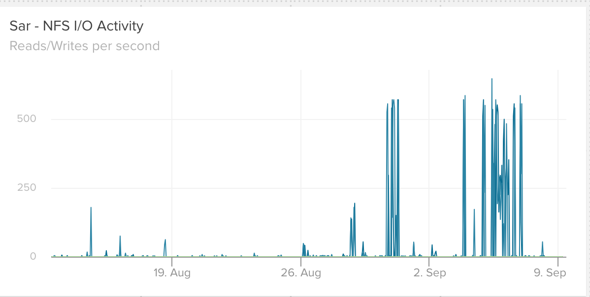
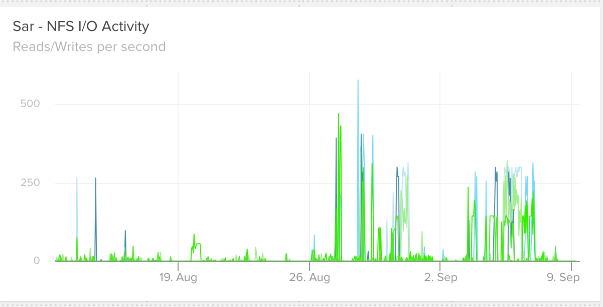
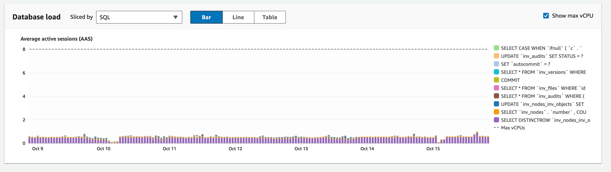

## Adopting Monthly Operational Review Meetings as a Learning Exercise

- Terry Brady, Software Developer

https://github.com/terrywbrady

----

#### Adopting Monthly Operational Review Meetings as a Learning Exercise

https://github.com/CDLUC3/uc3-present

---

## Presentation Purpose

Staying on top of security threats and operational issues can be an overwhelming challenge and a tedious challenge.

----

## Outline

- Challenge: development team needs to track operational issues
- Our approach to this challenge
- What we learned

---

## Merritt Team

[Merritt](merritt.cdlib.org) is a Digital Preservation Service that is run by the [California Digital Library](cdlib.org)

----

## Merritt System

- 1.4 PB of Cloud Storage (3 distinct providers)
- 4.5M Objects
- 188M Files
- 7 microservices, 26 Servers
- MySQL, ZooKeeper
- https://github.com/cdluc3/mrt-doc

----

## Team Roles

- 1 Product Manager
- 3 Software Developers
- 1 DevOps engineer (supporting multiple teams)

----

## Our Backgrounds

- Primarily software development (Java, Ruby, SQL)
- One developer has a Systems Admin background
- Our DevOps engineer has a Systems Admin background
- CDL has 3 full-time Systems Administrators supporting multiple teams

----

## DevOps Adoption at CDL

- We are adopting a DevOps approach
- Need to empower developers to perform operational functions
  - without turning them into Systems Administrators

----

## Immediate Needs for the Develpment Team to Take On

- Capacity Planning
- Software End of Life
- Software Dependencies
- Proactive Error Discovery

----

## Not our Expertise

- Need to learn functions that have not traditionally been part of software development
- While still primarily focusing on software development

----

## Discussion

- Does this challenge sound familiar?
- How has your team addressed this challenge?

---

## Our Approach

----

## Let's Figure it Out Together!

- Hold each other accountable
- Learn together
- Hopefully make it more interesting
- Iteratively improve our approach

----

## Our Process

- Schedule time once a month
- Limit to 30 minutes
- Accomplish as much as we can
- Figure it out together
- Document learnings
- Document a script the next session

----

## Areas of Focus

- Capacity Planning - Server Performance
- Software Dependency Review
  - Vulnerabilities
  - End of Life
- Proactive Error Log Tracking

---

## Capacity Planning - Server Performance

----

## Our Meeting Script

- The actual script resides in a private repository.  
- A [sanitized version](https://github.com/CDLUC3/uc3-present/blob/main/monthly_ops/routine_librato_checks.md) is provided here.

----

## Store/Ingest - subject to peak processing

- Ingest service: download and validate
- Storage service: upload to S3 and validate

----

## Review Monthly Stats

- Identify peak processing
----

Bytes Processed over 30 days

----

## Server Notes

- Link to performance charts
- Expected performance
- Key items to review

----

## Sample Performance Charts

----

## Storage Service

- Look for sustained CPU near 100%
- Look for peaks in SAR NFS
- Look for any significant drops in available memory or high swap

----

Storage Server - CPU

----

Storage Server - IO Wait

----

Storage Server - NFS wait

----

Storage Server - Memory Headroom

----

## Ingest boxes

- Look for high I/O wait
- Look for peaks in SAR NFS
- Look for any significant drops in available memory or high swap
  - Note trends in memory before and after patching

----

Ingest Server - CPU 

----

Ingest Server - IO wait

----

Ingest Server - NFS wait

----

Ingest Server - Memory Headroom

----

## Database

----

## Audit - constant load

----

## Query Performance

- Our system administrators have enabled RDS Performance Insights for the most recent 7 days 
- Our query performance is quite stable at this time

----

RDS Performance Insights

----

## Learnings - Capacity Planning

----

## Learnings - What to ignore
- server patching
- software releases
- known service downtimes

----

## Learnings - Issues Resolved

- IO Wait revealed
  - need for optimized instance types
  - replace EFS with ZFS

----

## Leanings - Continue to Watch

- RAM - Available headoom
  - Memory Leaks

----

## Discussion

- How do your teams review server performance?
- How do your teams perform capacity planning?

---

## Software Dependency Checks

- Vulnerabilities in Code Repos
- End of life for Code Frameworks
- Obsolete versions of 3rd Party software

----

## Software Dependency Review

- The actual script resides in a private repository.  
- A [sanitized version](https://github.com/CDLUC3/uc3-present/blob/main/monthly_ops/routine_librato_checks.md) is provided here.
  - _some non-public links have been obscured_

----

## Code Repo Vulnerabilities

- Review
- Evaluate severity
- Assign tickets to resolve

----

## Review Feature Library Versions

- Database
- ZooKeeper
- Apache Tika

----

## Review Language Version and End of Life

- Ruby
- Java

----

## Review Framework Versions and End of Life

- Rails
- Tomcat
- jQuery

----

## Review Build Tool Versions 

- Apache Maven

----

## Review Build Tool Plugin Versions

- Maven plugins

----

## Set Schedule for Next Review

----

## Identify General Purpose Libraries with New Versions

- we have identified a tool
- we have not yet implemented this
- we just completed a large migration

----

## Learnings Dependency Review

----

## Learnings

- The information we needed was available online
  - reference sites to search
  - services/sites that push alerts to us

----

## Learnings

- Some checks are OK to do quarterly or biannually
  - we should note when the next review should occur

----

## Learnings

- We have been rewarded by every effort we have made to 
  - normalize builds
  - consolidate dependency configuration

----

## Discussion

- How do your teams review software vulnerabilities?
- How do your teams keep 3rd party software up to date?

---

## Error Logs

----

## Consolidated Error Logs

- We consolidated all of our logs in OpenSearch in 2023

----

## Consolidated Logs

- Expedites investigation of a user-reported problem

----

## Consolidated Logs

- Enables us to discover errors before they become user-reported problems

----

## Error Discovery

- We rely on 
  - OpenSearch Saved Searches
  - OpenSearch Visualizations
  - OpenSearch Dashboards
  - Constantly refining our focus

----

## Dashboard Review

- The actual script resides in a private repository.  
- A [copy](https://github.com/CDLUC3/uc3-present/blob/main/monthly_ops/dashboard_review.md) is provided here.

----

## Web Application Firewall (WAF) Logs

- Make note of timeframes where errors may have been introduced by malicious activity
- Idenitify categories of malicious activity

----

WAF Logs

----

## User Interface Errors by return code

----

## User Interface Errors

----

## Backend Service Errors

----

Capacity analysis using application logs

----

## Learnings - WAF

- Rate limit attempts at malicious login
- Limit resource-intensive queries from unauthenticated logic

----

## Leanings Capacity Analysis

- Identified uncontrolled client activity that was driving a need for additional resouces
  - 18T of assembled downloads per week!

----

## Discussion

- How do your teams handle error logs?
- Do you have a process to discover unreported errors?

---

## Our Review Meeting Process

- Review
- Document action items as tickets
- Refine script for the next meeting

----

## Meetings

- Initially, we ran out of time at each meeting
- Eventually, we can cover the script in half of the time
- End early
- OR identify how to go deeper

----

## Meetings

- An additional meeting is an interruption
- Generally, we are glad we did it by the end
- It is more fun when something went wrong during the month

----

## Team Member Feedback

- Connects team members to Security 
- Connects team members to Cost Information
  - Cost review is handle by our DevOps engineer
- Greater appeciation of what our logs can do

----

## Beyond Our Team

- Our manager appreciates the ability to dive into details with the team
- Other folks from our departments have joined to observe the process
- This has given the intiative a nice boost

----

## Script

- Script contains collecttive learning
- Regular review builds confidence
- We challenge ourselves to go deeper as we have solved the immediate issues

----

## Discussion

- Do these ideas sound applicable to your environments?

---

## Where to go next

----

## Capacity Planning

- Covered pretty well at the server level
- Key metric computations could be interesting

----

## Software dependencies

- Library updates unrelated to vulnerabilities

----

## Error Logs

- What content is missing from our log files
- What index keys are needed
- What visualizations are needd

----

## Fun Questions to Answer

- What system functions require the most retries?
- Can we graph periods of time where retries increase?
- Can we graph retries required by cloud provider?

---

## Thank You
- https://github.com/terrywbrady
  - UCTech Slack: Terry Brady (UCOP-CDL)