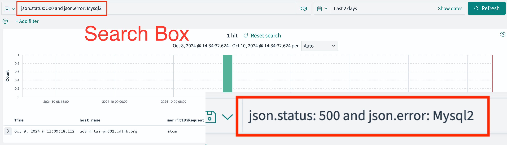
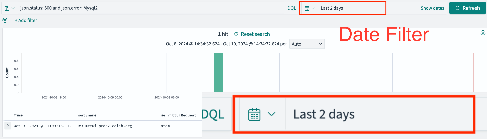
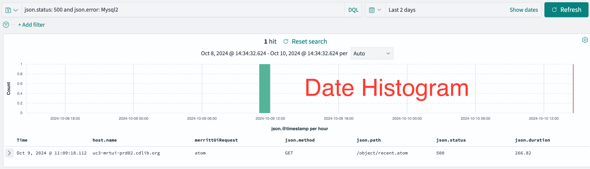
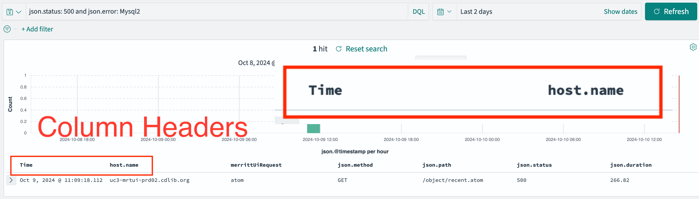
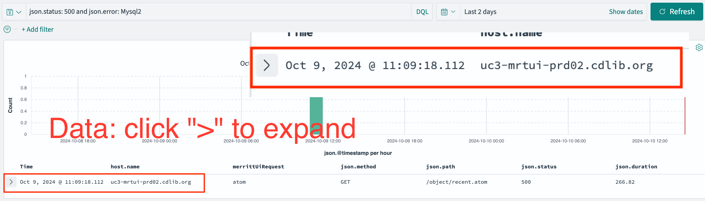

### OpenSearch For The Productivity Win; Fostering Adoption Across Teams

- Marisa Strong, Development Team Manager
- Terry Brady, Software Developer

https://github.com/CDLUC3/uc3-present

Note:
Marisa
----


# Who We Are

Note:
Marisa
----

## California Digital Library 

CDL provides transformative digital library services, partnering both with UC campuses and external collaborators, we amplify the impact of the libraries, scholarship, and resources of the University of California. 

----

### CDL has 4 active programs:

- Publishing & Special Collections
- Discovery & Delivery
- Collections & Licensing
- UC Curation Center (UC3)

----

## UC3

The mission of University of California Curation Center (UC3) is to provide transformative preservation, curation, and research data management systems, services, and initiatives that sustain and promote open scholarship.

----

## UC3 Architecture


---
## UC3 3rd Party Applications


---

# Background

Note:
Marisa
----

## The Log4J incident

Raised the priority to improve our logging systems to 
- be able to patch and address security vulnerabilities
- inconsistent logging across our microservices
- distributed environment

----

## Logging Needs
- Find specific error events in logs 
- Calculate metrics
- Discover unreported errors

----

<iframe src="https://wall.sli.do/event/jinWX26j29xcvvcwNiQKKc?section=74c18def-f759-428f-a16d-68e6dad939c5" frameBorder="0" allow="clipboard-write" title="Slido"></iframe>

---

# Why Opensearch for Logs?


Note:
Marisa
----

## Need for Consolidated Logging

- CDL had Splunk
- Development teams did not have access
- CDL is an AWS shop
- OpenSearch is the AWS solution for logs

---

# What is OpenSearch?

Note:
Terry
----

## An Open Source fork of Elasticsearch

- https://opensearch.org/

----

## Elastic (corporation) created Elasticsearch

- https://www.elastic.co/

----

## Elasticsearch

- Search engine built on Apache Lucene
- NoSQL database
- Indexing JSON documents
- Core to the **ELK stack**

----

## ELK Stack

- Elasticsearch (search engine)
- Logstash (file ingestion)
- Kibana (web interface)
- https://aws.amazon.com/what-is/elk-stack/

----

## Elastic and AWS

- Conflict: Elastic vs AWS
- 2021
  - Elastic changed the licensing for Elasticsearch and Kibana
  - AWS created OpenSearch
- 2024
  - [Elastic changed the license again in 2024](https://www.elastic.co/blog/elasticsearch-is-open-source-again)

----

## OpenSearch - An Open Source Version of the ELK Stack

----

## ELK Equivalents

- Elasticsearch --> OpenSearch
- Logstash --> Logstash
- Kibana --> OpenSearch Dashboards

----

## Other Concepts

- [Elastic Common Schema](https://www.elastic.co/guide/en/ecs/current/ecs-principles-implementation.html) (ECS)
  - json standard way of generating logs
  - used in open telemetry initiatives
 - common language support

----

## ECS Sample Fields

- @timestamp
- method: GET | POST | PUT
- status: 200 | 401 | 404 | 500
- path: /foo/bar
- query: a=b&c=d
- duration

----

## What can we do with ELK / OpenSearch Stack?

---

# Log Exploration


Note:
Terry
----

## Find specific error events in logs 

- High availability services (multiple instances)
- Eventual migration to containers - log directories will be less accessible

----

Isolating a single error with OpenSearch search.


----



----



----



----



----



----

Exploring the details of the error message (table view)


----

Exploring the details of the error message (json view)


----

The larger context of the OpenSearch "Discovery" tool.


----

## Calculate metrics

- How widely are functions utilized
- Frequency that functions are utilized
- Metric totals


----

## Storage Service calculates

For each cloud provider...
- Bytes added
- Bytes updated
- Bytes assembled and zipped
- Bytes processed per millisecond

----

These calculations enable some useful visualizations


----

Merritt UI requests categorized by request type


----

## Discover unreported errors

- Aggregate counts by return code

----

Merritt UI Return Code Counts


----

Merritt UI Return Code Counts... with analysis notes


----

## As we ingested logs...

- We realized that OpenSearch is a great visualization tool
- for OUR DATA, not just our logs

----

## As we explored data in OpenSearch

- We realized that it could be a great SEARCH tool
- for OUR DATA, not just our logs

----

<iframe src="https://wall.sli.do/event/jinWX26j29xcvvcwNiQKKc?section=74c18def-f759-428f-a16d-68e6dad939c5" frameBorder="0" allow="clipboard-write" title="Slido"></iframe>


---

# OpenSearch - Our Learning Process


Note:
Terry
----

## Docker distribution of OpenSearch

----

## OpenSearch Docker Image

```yaml
  opensearch:
    image: opensearchproject/opensearch
    container_name: opensearch
```

----

## Logstash Docker Image

```yaml
  logstash:
    image: opensearchproject/logstash-oss-with-opensearch-output-plugin
    container_name: logstash
```

----

## OpenSearch Dashboards Docker Image

```yaml
  opensearch-dashboards:
    image: opensearchproject/opensearch-dashboards
    container_name: opensearch-dashboards
```

----

## Creating a tutorial to understand the components

- https://github.com/CDLUC3/opensearch-tutorial

----

Sample Dashboard Bundled with OpenSearch: Flight Data


----

## Helpful LinkedIn Learning Resources

- [Learning the Elastic Stack](https://www.linkedin.com/learning/learning-the-elastic-stack-2?u=76816210)
- [Elastic Search in Depth](https://www.linkedin.com/learning/elasticsearch-in-depth?u=76816210)

---

# Learning OpenSearch Ingest

Note:
Terry

----

## Load sample log files into OpenSearch

- AWS load balancer logs
- Apache and Tomcat logs
- Log4j formatted text log files

----

## Logstash uses regular expressions

- parse data
- normalize data
- determine rules to apply

----

## Logstash Parsing

```conf
  grok {
    pattern_definitions => { 
      "ELB_REQUEST_LINE" => "(?:%{WORD:verb} %{ELB_URI:request}(?: HTTP/%{NUMBER:httpversion})?|%{DATA:rawrequest})"
      "ELB_URIPATHPARAM" => "%{URIPATH:path}(?:%{URIPARAM:params})?"
      "ELB_URI" => "%{URIPROTO:proto}://(?:%{USER}(?::[^@]*)?@)?(?:%{URIHOST:urihost})?(?:%{ELB_URIPATHPARAM})?"
    }
    match => [ "message", '%{TIMESTAMP_ISO8601:timestamp} %{NOTSPACE:elb} %{IP:clientip}:%{INT:clientport:int} (?:(%{IP:backendip}:?:%{INT:backendport:int})|-) %{NUMBER:request_processing_time:float} %{NUMBER:backend_processing_time:float} %{NUMBER:response_processing_time:float} %{INT:response:int} %{INT:backend_response:int} %{INT:received_bytes:int} %{INT:bytes:int} "%{ELB_REQUEST_LINE:req}" "%{DATA:user_agent_raw}" %{NOTSPACE:ssl_cipher} %{NOTSPACE:ssl_protocol} %{NOTSPACE:target_group_arn} %{QUOTEDSTRING:trace_id} "%{DATA:domain_name}" "%{DATA:chosen_cert_arn}" %{NUMBER:matched_rule_priority:int} %{TIMESTAMP_ISO8601:request_creation_time} "%{DATA:actions_executed}" "%{DATA:redirect_url}" "%{DATA:error_reason}" "%{DATA:misc_ip}" "%{DATA:misc_status}" "%{DATA:misc_a}" "%{DATA:misc_b}"']
  }
```

----

## Date Normalization is Critical

- Date/time filters are a primary filter in OpenSearch dashboards
- Discovery tool provids a date histogram for analysis

----

## 11/Oct/2024:10:11:22 -0700

```conf
filter {
  date {
    locale => en
    match => [ "[json_data][time]", "[dd/MMM/yyyy:HH:mm:ss Z]" ]
    target => "@timestamp"
  }
}
```

----

## 2024-10-11T10:11:12.345-0700

```conf
filter {
  date {
    locale => en
    match => [ "[json_data][@timestamp]", "yyyy-MM-dd'T'HH:mm:ss.SSS'Z'" ]
    target => "@timestamp"
  }
}
```

----

## OpenSearch as an AWS managed service (for logs)

- internal users only
- log data may be unsanitized - must keep secure

----

## Types of logs

- Application logs
- Load balancer logs
- Serverless application logs
- Application firewall logs
- System logs
- Logstash logs

----

## 💬 Discussion: what types of logs do you have?

----

## Log Ingest Challenges

- Complex regular expressions
- Logs that are not log files
- Application inconsistency

----

## Challenge: Complex Regex

```conf
  grok {
    pattern_definitions => { 
      "ELB_REQUEST_LINE" => "(?:%{WORD:verb} %{ELB_URI:request}(?: HTTP/%{NUMBER:httpversion})?|%{DATA:rawrequest})"
      "ELB_URIPATHPARAM" => "%{URIPATH:path}(?:%{URIPARAM:params})?"
      "ELB_URI" => "%{URIPROTO:proto}://(?:%{USER}(?::[^@]*)?@)?(?:%{URIHOST:urihost})?(?:%{ELB_URIPATHPARAM})?"
    }
    # note user_agent is reserved, values do not seem parseable
    # wildcard example %{GREEDYDATA:syslog_message}
    match => [ "message", '%{TIMESTAMP_ISO8601:timestamp} %{NOTSPACE:elb} %{IP:clientip}:%{INT:clientport:int} (?:(%{IP:backendip}:?:%{INT:backendport:int})|-) %{NUMBER:request_processing_time:float} %{NUMBER:backend_processing_time:float} %{NUMBER:response_processing_time:float} %{INT:response:int} %{INT:backend_response:int} %{INT:received_bytes:int} %{INT:bytes:int} "%{ELB_REQUEST_LINE:req}" "%{DATA:user_agent_raw}" %{NOTSPACE:ssl_cipher} %{NOTSPACE:ssl_protocol} %{NOTSPACE:target_group_arn} %{QUOTEDSTRING:trace_id} "%{DATA:domain_name}" "%{DATA:chosen_cert_arn}" %{NUMBER:matched_rule_priority:int} %{TIMESTAMP_ISO8601:request_creation_time} "%{DATA:actions_executed}" "%{DATA:redirect_url}" "%{DATA:error_reason}" "%{DATA:misc_ip}" "%{DATA:misc_status}" "%{DATA:misc_a}" "%{DATA:misc_b}"']
  }
```

----

## Challenge: Non Log Files

- AWS ELB Logs go to S3 buckets
- AWS WAF Logs to to Kinesis
- Not all inputs go through logstash!

----

## Challenge: Application Log Inconsistency

- Java code vs Ruby Code
- Different log4j configurations
- Chatty, multi-line log files

----

## Log Inconsistency

- [Elastic Common Schema "ECS"](https://www.elastic.co/guide/en/ecs/current/ecs-principles-implementation.html)


---

# Learning "ECS"


Note:
Terry
----

## "ECS" Implementations for logs

- https://github.com/elastic/ecs-logging/blob/main/README.md
  - Support for 8 languages

----

## OpenTelemetry - Going Deeper

- https://opentelemetry.io/docs/what-is-opentelemetry/
- We have not explored this yet

---

# Learning OpenSearch Visualization


Note:
Terry

----

## Visualizing Logs

----

## Log Dashboards

- Visualization
- Search box
- Filters
- Sample log records

----

Demo: Merritt Application Logs


----

Merritt Web Application Firewall Logs


----

<iframe src="https://wall.sli.do/event/jinWX26j29xcvvcwNiQKKc?section=74c18def-f759-428f-a16d-68e6dad939c5" frameBorder="0" allow="clipboard-write" title="Slido"></iframe>

---

# What about Data (vs Logs)?


Note:
Terry
----

Merritt cumulative ingests


----

## Merritt Object Health

- An analysis process is run against Merritt objects
- Analysis is written as a rich JSON structure
- Assertions/tests are run against the analysis
- OpenSearch can filter for analysis results

----

Merritt Object Health Filtering


----

## Deep Dive - Merritt Object Health

More information on this project is available here.

- [Merritt Object Health - 13m Video](https://youtu.be/QtLZpID_THo?si=kwwoDTJq_AsRauBU)

----

## Incorporating Opensearch into EZID


Note:
Marisa

----

EZID WAF Dashboard


Note:
Marisa

----

EZID ELB Dashboard


----

# Logs vs Data - Interesting Challenges


Note:
Marisa
----

## OpenSearch (Search and Dashboard) as an AWS managed service (for data)

- deploy to end users
- different security challenges

----

## OpenSearch (Search Only) as a search engine

- embedded into a production application

----

# UC3 Team Collaboration and Process


Note:
Marisa
----

## UC3 team
- 8 software developers
- 1 dev ops 
- developers dedicated to services

----

## Prototype
- DevOps engineer created prototype Docker configuration
- Terry loaded sample logs to prototype configuration
- Creation of sample logstash rules for very predictable files
- DevOps created managed service deployment

----

## Load general logs for Merritt

- alb
- waf
- apache
- tomcat

----

## Adopted by other teams
- Tutorial 
- Load general logs for EZID
- Load application log files
- Learn about ECS

----

## Explore OpenSearch as a Search tool
 - indexing
 - incorporating it into API and UI functions

---

## Cross team knowledge sharing
- weekly AWS environment chat
- monthly TechX - CDL wide 
- monthly Dev Coffee 
- monthly planning discussions with our infrastructure team


# Open Search Community Engagement


Note:
Terry
----

## Community Resources
- [OpenSearch Slack channel](https://opensearch.org/slack.html)
- [Community Meetings](https://opensearch.org/events/calendar/2024/october/)
- [GitHub Issues and Discussion](https://github.com/opensearch-project)
- [Conference](https://opensearch.org/events/opensearchcon/2024/north-america/index.html)

----

## Helpful Resources for OpenSearch
- [OpenSearch Docs](https://opensearch.org/docs/latest/)
- [Logstash](https://www.elastic.co/guide/en/logstash/current/index.html)
- [UC3 Team Tutorial](https://github.com/CDLUC3/opensearch-tutorial)

----

## Sysadmin Best Practices
- [AWS OpenSearch Developer Guide](https://docs.aws.amazon.com/opensearch-service/latest/developerguide/bp.html#bp-sharding-strategy)

----

## Other Things we Have Learned

- You can export and import your visualizations and dashboards using the API (as ndjson files)
- We plan to manage these with git
- [Sample script to load ndjson files to a dockerized version of dashboards](https://github.com/CDLUC3/opensearch-tutorial/blob/main/scripts/init-opensearch.sh)

----

## 💬 Discussion: What are your thoughts about OpenSearch?

---

## Thank You
- https://github.com/marisastrong
  - UCTech Slack: Marisa Strong (UCOP CDL)
- https://github.com/terrywbrady
  - UCTech Slack: Terry Brady (UCOP-CDL)
- https://uc3.cdlib.org/


Note:
Marisa