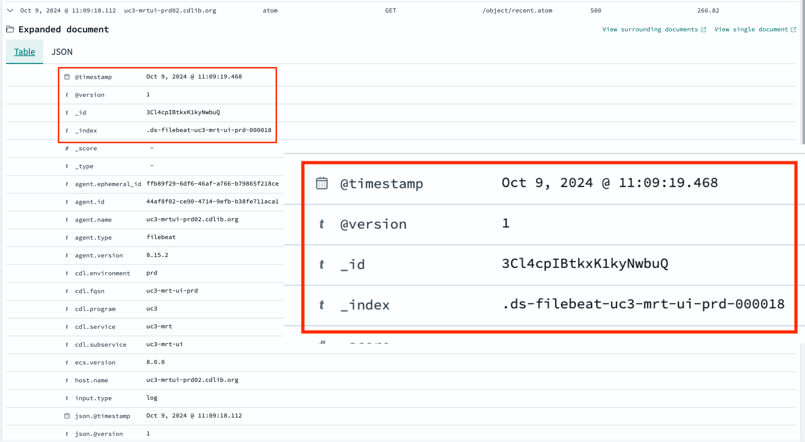
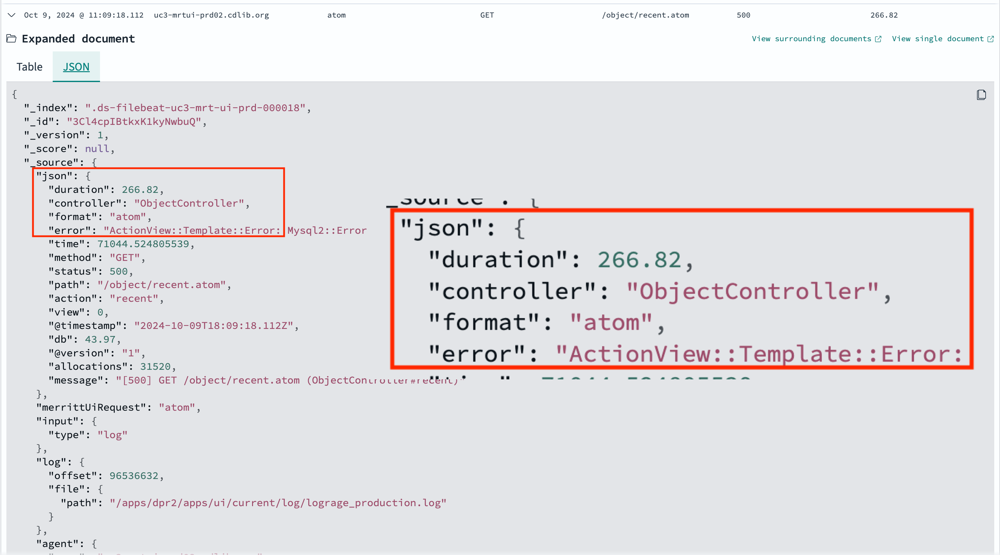

## OpenSearch For The Productivity Win; Fostering Adoption Across Teams

- Marisa Strong, Development Team Manager
- Terry Brady, Software Developer

---

## Who We Are

----

## California Digital Library (CDL)

CDL provides transformative digital library services, grounded in campus partnerships and extended through external collaborations, that amplify the impact of the libraries, scholarship, and resources of the University of California. 

----

CDL was explicitly created as a central unit within the 
UC system with a mission to coordinate, leverage, and amplify the experience, expertise, and capabilities of its partners.

----

### CDL has 4 active programs:

- Publishing & Special Collections
- Discovery & Delivery
- Collections & Licensing
- UC Curation Center (UC3)

----

## UC3

----

## UC3 Architecture

---

## Background

---

## The Log4J incident

Raised the priority to improve our logging systems to 
- be able to patch and address security vulnerabilities
- inconsistent logging across our microservices
- distributed environment

----

## Logging Needs
- Find specific error events in logs 
- Compute key event metrics
- Discover unreported errors

----

## Discussion: Your Logging Needs

---

## Why Opensearch for Logs?

----

## Need for Consolidated Logging

- CDL had Splunk
- Developement teams did not have access
- CDL is an AWS shop
- OpenSearch is the AWS solution for logs

---

## What is OpenSearch?

- https://opensearch.org/

----

## An OpenSource fork of Elasticsearch

----

## Elastic (corporation) created Elasticsearch

- https://www.elastic.co/

----

## Elasticsearch

- Search engine built on Apache Lucene
- Core to the `ELK stack`

----

## ELK Stack

- Elasticsearch (search engine)
- Logstash (file ingestion)
- Kibana (web interface)
- https://aws.amazon.com/what-is/elk-stack/

----

## Elastic and AWS

- Conflict with AWS
- Elastic changed the licensing for Elasticsearch and Kibana
- AWS created OpenSearch
- Note: [Elastic changed the license again in 2024](https://www.elastic.co/blog/elasticsearch-is-open-source-again)

----

## OpenSearch - An Open Source Version of the ELK Stack

----

## ELK Equivalents

- Elasticsearch --> OpenSearch
- Logstash --> Logstash
- Kibana --> OpenSearch Dashboards

----

## Other Concepts

- Elastic Common Schema (ECS)
  - json standard way of generating logs
  - used in open telemetry initiatives
 - common language support

----

## What can we do with ELK / OpenSearch?

---

## Log Exploration

----

## Find specific error events in logs 

- High avalability services (multiple instances)
- Eventual migration to containers - log directories will be less accessible

----

Isolating a single error with OpenSearch search.


----

Exploring the details of the error message (table view)



----

Exploring the details of the error message (json view)



----

The larger context of the OpenSearch "Discovery" tool.


----

## Compute key event metrics

- How widely are functions utilized
- Frequency that functions are utilized
- Metric totals


----

Cumulative bytes processed by the Merritt Storage service by function and storage provider


----

Merritt UI requests categorized by request type


----

## Discover unreported errors

- Aggregate counts by return code

----

Merritt UI Return Code Counts


----

Merritt UI Return Code Counts... with analysis notes


----

## Discussion: Your Logging Tools

----

## As we ingested logs...

- We realized that OpenSearch is a great visualization tool
- for OUR DATA, not just our logs

----

## As we explored data in OpenSearch

- We realized that it could be a great SEARCH tool
- for OUR DATA, not just our logs

---

## OpenSearch - Our Learning Process

----

## Docker distribution of OpenSearch

----

## OpenSearch Docker Image

```yaml
  opensearch:
    image: opensearchproject/opensearch
    container_name: opensearch
```

----

## Logstash Docker Image

```yaml
  logstash:
    image: opensearchproject/logstash-oss-with-opensearch-output-plugin
    container_name: logstash
```

----

## OpenSearch Dashboards Docker Image

```yaml
  opensearch-dashboards:
    image: opensearchproject/opensearch-dashboards
    container_name: opensearch-dashboards
```

----

## Creating a tutorial to understand the components

- https://github.com/CDLUC3/opensearch-tutorial

----

Sample Dashboard Bundled with OpenSearch: Flight Data


----

## Helpful LinkedIn Learning Resources

- [Learning the Elastic Stack](https://www.linkedin.com/learning/learning-the-elastic-stack-2?u=76816210)
- [Elastic Search in Depth](https://www.linkedin.com/learning/elasticsearch-in-depth?u=76816210)

----

## Load sample log files into OpenSearch

- AWS load balancer logs
- Apache and Tomcat logs
- Log4j formatted text log files

----

## Logstash uses regular expressions

- parse data
- normalize data
- determine rules to apply

----

## Date Normalization is Critical

- Date/time filters are a primary filter in OpenSearch dashboard
- Discovery tool provids a date historgram for analysis

----

## 11/Oct/2024:10:11:22 -0700

```conf
filter {
  date {
    locale => en
    match => [ "[json_data][time]", "[dd/MMM/yyyy:HH:mm:ss Z]" ]
    target => "@timestamp"
  }
}
```

----

## 2024-10-11T10:11:12.345-0700

```conf
filter {
  date {
    locale => en
    match => [ "[json_data][@timestamp]", "yyyy-MM-dd'T'HH:mm:ss.SSS'Z'" ]
    target => "@timestamp"
  }
}
```

----

## OpenSearch as an AWS managed service (for logs)

- internal users only
- log data may be unsanitized - must keep secure

----

## Types of logs

- Application logs
- Load balancer logs
- Serverless application logs
- Application firewall logs
- System logs
- Logstash logs

----

## Discussion: what types of logs do you have

----

## Log Ingest Challengs

- Crazy regular expressions
- Logs that are not log files
- Application inconsistency

----

## Challenge: Complex Regex

```conf
  grok {
    pattern_definitions => { 
      "ELB_REQUEST_LINE" => "(?:%{WORD:verb} %{ELB_URI:request}(?: HTTP/%{NUMBER:httpversion})?|%{DATA:rawrequest})"
      "ELB_URIPATHPARAM" => "%{URIPATH:path}(?:%{URIPARAM:params})?"
      "ELB_URI" => "%{URIPROTO:proto}://(?:%{USER}(?::[^@]*)?@)?(?:%{URIHOST:urihost})?(?:%{ELB_URIPATHPARAM})?"
    }
    # note user_agent is reserved, values do not seem parseable
    # wildcard example %{GREEDYDATA:syslog_message}
    match => [ "message", '%{TIMESTAMP_ISO8601:timestamp} %{NOTSPACE:elb} %{IP:clientip}:%{INT:clientport:int} (?:(%{IP:backendip}:?:%{INT:backendport:int})|-) %{NUMBER:request_processing_time:float} %{NUMBER:backend_processing_time:float} %{NUMBER:response_processing_time:float} %{INT:response:int} %{INT:backend_response:int} %{INT:received_bytes:int} %{INT:bytes:int} "%{ELB_REQUEST_LINE:req}" "%{DATA:user_agent_raw}" %{NOTSPACE:ssl_cipher} %{NOTSPACE:ssl_protocol} %{NOTSPACE:target_group_arn} %{QUOTEDSTRING:trace_id} "%{DATA:domain_name}" "%{DATA:chosen_cert_arn}" %{NUMBER:matched_rule_priority:int} %{TIMESTAMP_ISO8601:request_creation_time} "%{DATA:actions_executed}" "%{DATA:redirect_url}" "%{DATA:error_reason}" "%{DATA:misc_ip}" "%{DATA:misc_status}" "%{DATA:misc_a}" "%{DATA:misc_b}"']
  }
```

----

## Challenge: Non Log Files

- AWS ELB Logs go to S3 buckets
- AWS WAF Logs to to Kinesis
- Not all inputs go through logstash!

----

## Challenge: Application Log Inconsistency

- Java code vs Ruby Code
- Different log4j configurations
- Chatty, multi-line log files

----

## Log Inconsistency

- [Elastic Common Schema "ECS"](https://www.elastic.co/guide/en/ecs/current/ecs-principles-implementation.html)

----

## "ECS" Implementations for logs

- https://github.com/elastic/ecs-logging/blob/main/README.md
  - Support for 8 langauges

----

## OpenTelemetry - Going Deeper

- https://opentelemetry.io/docs/what-is-opentelemetry/
- We have not explored this yet

----

## Visualizing Logs


----

## Log Dashboards

- Visualization
- Filters
- Sample log records

----

## Demo: Merritt Application Logs

- filters
- timelines
- selected columns
- aggregate countts

----

## Discussion - How do you explore log files

----

## Demo: Load Balancer Logs

----

## Demo: Web Application Firewall Logs

----

## What about Data?

- Demo: Merritt cumulative ingests

----

## OpenSearch as an AWS manage service (for data)

- deploy to end users
- different security challenges

---

## UC3 Team Collaboration and Process

----

## Screenshot Merritt System Cumulative Totals

----

## Merritt System - Object Health

- [Video](https://youtu.be/QtLZpID_THo?si=kwwoDTJq_AsRauBU)

----

## EZID Demo

- add video of search tool

----

## DMP Tool - Open Search

- add video if applicable

----

## Discussion: What stories could you tell by visualizing your application data?

---

## Open Search Community Engagement

- Slack channel
- Community Meetings

---

## Helpful Resources for OpenSearch

- summarize tutorial resources
- Ashley's admin resources (index configuration)
- Ashley's admin resources (hosting)

---

## Thank You
